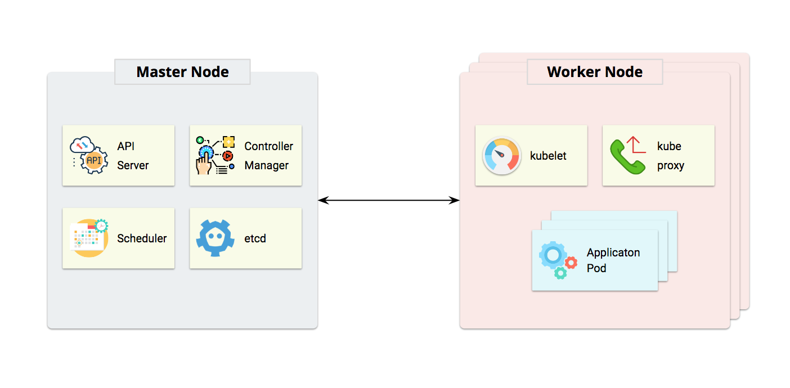
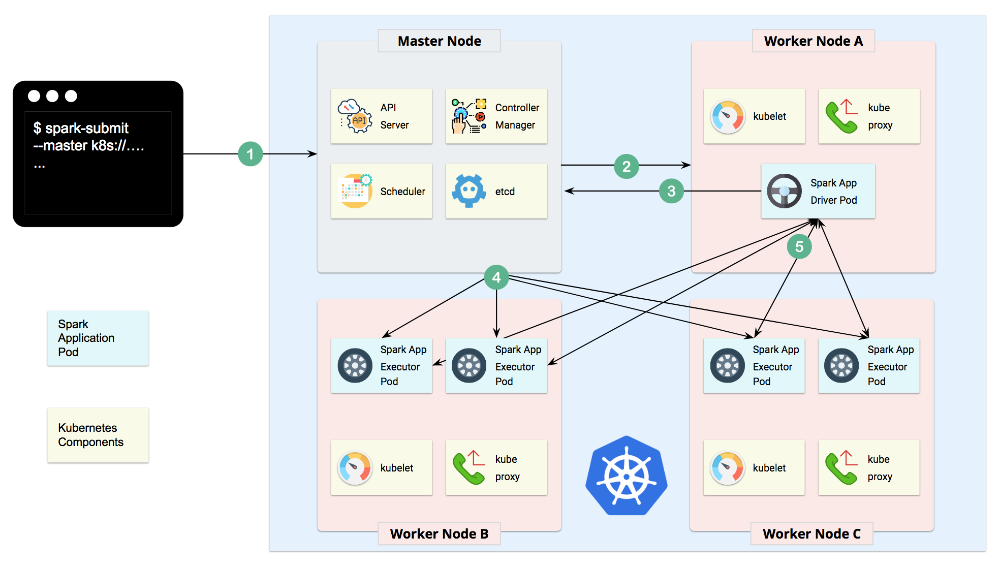
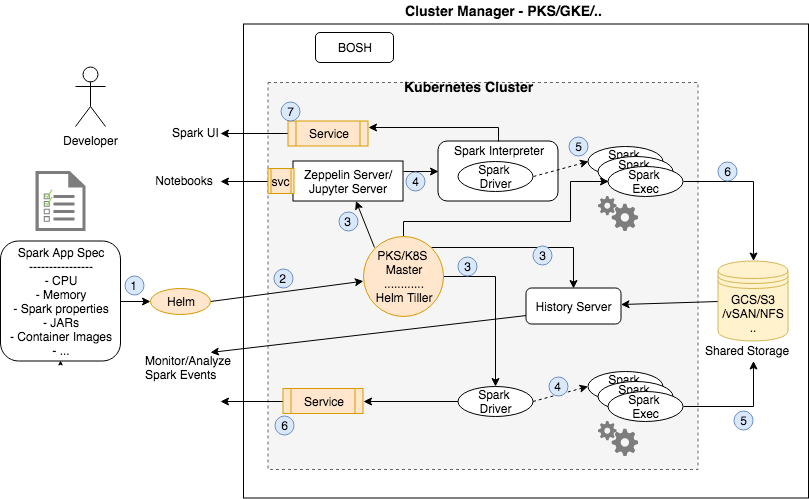

# Multi cloud Spark application service on PKS

## Introduction
[Kubernetes](https://kubernetes.io/) is an open source project designed specifically for container orchestration. 
Kubernetes offers a number of key [features](https://kubernetes.io/docs/concepts/overview/what-is-kubernetes/), 
including multiple storage APIs, container health checks, manual or automatic scaling, rolling upgrades and 
service discovery.
[Pivotal Container Service - PKS](https://pivotal.io/platform/pivotal-container-service) is a solution to manage 
Kubernetes clusters across private and public clouds. It leverages [BOSH](https://bosh.io/) to offer a uniform way to instantiate, 
deploy, and manage highly available Kubernetes clusters on a cloud platform like GCP, VMWare vSphere or AWS. 

This project provides a streamlined way of deploying, scaling and managing Spark applications. Spark 2.3 added support
for Kubernetes as a cluster manager. This project leverages [Helm charts](https://helm.sh/) to allow deployment of 
common Spark application recipes - using [Apache Zeppelin](https://zeppelin.apache.org/) and/or [Jupyter](https://jupyter.org/) 
for interactive, collaborative workloads. It also automates logging of all events across batch jobs and Notebook driven
applications to log events to shared storage for offline analysis.   


Helm is a package manager for kubernetes and the most productive way to find, install, share, upgrade and use even the 
most complex kubernetes applications. So, for instance, with a single command you can deploy additional components like 
HDFS or Elastic search for our Spark applications.  

This project is a collaborative effort between SnappyData and Pivotal. 


## Features
- Full support for Spark 2.2 applications running on PKS 1.x on both Google cloud and on-prem VMWare cloud environments.
The project leverages [spark-on-k8s](https://github.com/apache-spark-on-k8s/spark) work.
- Deploy batch spark jobs using kubernetes master as the cluster/resource manager
- Helm chart to deploy Zeppelin, centralized logging, monitoring across apps (using History server)
- Helm chart to deploy Jupyter,  centralized logging, monitoring across apps (using History server)
- Use kubernetes persistent volumes for notebooks and event logging for collaboration and historical analysis
- Spark applications can be Java, Scala or Python
- Spark applications can dynamically scale

We use Helm charts to abstract the developer from having to understand kubernetes concepts and simply focus on 
configuration that matters. Think recipes that come with sensible defaults for common Spark workloads on PKS. 

We showcase the use of cloud storage (e.g. Google Cloud Storage) to manage logs/events but show how the use persistent 
volumes within the charts make the architecture portable across clouds. 

## Pre-requisites and assumptions:
- We need a running kubernetes or PKS cluster. We only support Kubernetes 1.9 (or higher) and PKS 1.0.0(or higher).

 **NOTE** If you already have access to a Kubernetes cluster, jump to the [next section](#steps-if-a-kubernetes-cluster-is-available).

### Getting access to a PKS or Kubernetes cluster
If you would like to deploy on-prem you can either use Minikube (local developer machine) or get PKS environment setup 
using vSphere. 

#### Option (1) - PKS
- PKS on vSphere: Follow these [instructions](https://docs.pivotal.io/runtimes/pks/1-0/vsphere.html) 
- PKS on GCP: Follow these [instructions](https://docs.pivotal.io/runtimes/pks/1-0/gcp.html)
- Create a Kubernetes cluster using PKS CLI : Once PKS is setup you will need to create a k8s cluster as described 
[here](https://docs.pivotal.io/runtimes/pks/1-0/using.html)

#### Option (2) - Kubernetes on Google Cloud Platform (GCP)
- Login to your Google account and goto the [Cloud console](https://console.cloud.google.com/) to launch a GKE cluster

#### Option (3) - Minikube on your local machine
- If either of the above options is difficult, you may setup a test cluster on your local machine using 
[minikube](https://kubernetes.io/docs/getting-started-guides/minikube/). We recommend using the latest release of minikube 
with the DNS addon enabled.
- If using Minikube, be aware that the default minikube configuration is not enough for running Spark applications. 
We recommend 3 CPUs and 4g of memory to be able to start a simple Spark application with a single executor.

### Steps if a Kubernetes cluster is available 
- If using PKS, you will need to install the PKS command line tool. See instructions 
[here](https://docs.pivotal.io/runtimes/pks/1-0/installing-pks-cli.html)
- Install kubectl on your local development machine and configure access to the kubernetes/PKS cluster. See instructions for 
kubectl [here](https://kubernetes.io/docs/tasks/tools/install-kubectl/). If you are using Google cloud, you will find 
instructions for setting up Google Cloud SDK ('gcloud') along with kubectl 
[here](https://kubernetes.io/docs/tasks/tools/install-kubectl/).
- You must have appropriate permissions to list, create, edit and delete pods in your cluster. You can verify that you 
can list these resources by running `kubectl auth can-i <list|create|edit|delete> pods`.
- The service account credentials used by the driver pods must be allowed to create pods, services and configmaps. For example, 
if you are using `default` service account, assign 'edit' role to it for namespace 'spark' by using following command

```text
kubectl create clusterrolebinding spark-role --clusterrole=edit --serviceaccount=spark:default
```
<!--- TODO Why is this required?
- You must have Kubernetes DNS configured in your cluster.
--->


### Setup Helm charts

[Helm](https://github.com/kubernetes/helm/blob/master/README.md) comprises of two parts: a client and a server (Tiller) inside 
the kube-system namespace. Tiller runs inside your Kubernetes cluster, and manages releases (installations) of your charts. 
To install Helm follow the steps [here](https://docs.pivotal.io/runtimes/pks/1-0/configure-tiller-helm.html). The instructions
are applicable for any kubernetes cluster (PKS or GKE or Minikube).


### Quickstart

#### Launch Spark and Notebook servers

We use the spark-umbrella chart to deploy Jupyter, Zeppelin, Spark Resource Staging Server, and Spark Shuffle Service 
on Kubernetes. This chart is composed from individual sub-charts for each of the components. 
You can read more about Helm umbrella charts 
[here](https://github.com/kubernetes/helm/blob/master/docs/charts_tips_and_tricks.md#complex-charts-with-many-dependencies)

You can configure the components in the umbrella chart's 'values.yaml' (see [spark-umbrella/values.yaml](charts/spark-umbrella/values.yaml)) or in
each of the individual sub-chart's 'values.yaml' file. The umbrella chart's 'values.yaml' will override the ones in sub-charts.

```text
# fetch the chart repo ....
git clone https://github.com/SnappyDataInc/spark-on-k8s

# Get the sub-charts required by the umbrella chart
cd charts
helm dep up spark-umbrella

# Now, install the chart in a namespace called 'spark'
helm install --name spark-all --namespace spark ./spark-umbrella/
```
The above command will deploy the helm chart and will display instructions to access Zeppelin service and Spark UI.

> Note that this command will return quickly and kubernetes controllers will work in the background to achieve the state
specified in the chart. The command below can be used to access the notebook environment from any browser. 

```text
kubectl get services --namespace spark -w
# Note: this could take a while to complete. Use '-w' option to wait for state changes. 
```

Once everything is up and running you will see something like this:
```text
NAME                          TYPE           CLUSTER-IP      EXTERNAL-IP     PORT(S)                        AGE
spark-all-jupyter-spark       LoadBalancer   10.63.246.130   35.184.71.164   8888:31540/TCP,4040:30922/TCP  9m
spark-all-rss                 LoadBalancer   10.63.246.190   35.192.235.35   10000:31000/TCP                9m
spark-all-zeppelin            LoadBalancer   10.63.254.150   35.192.68.147   8080:30522/TCP,4040:31236/TCP  9m
```
> Access the zeppelin notebook environment using URL external-ip:8080 from any browser.
> Spark UI is accessible using URL external-ip:4040. 
NOTE that the Spark UI is only accessible after you have run at least one Spark job. Spark Driver (and hence UI) is lazily started. 
Simply navigate to <Zeppelin Home>; Click 'Zeppelin Tutorial' and then 'Basic Features(Spark)'. Run the 'Load
data' paragraph followed by one or more SQL paragraphs. 

#### Launch the kubernetes dashboard
> You can launch the Kubernetes dashboard (If using GCP you can get to the dashboard from the GCP console) to inspect the 
various deployed objects, associated pods and even connect to a running container.
```text
# To launch the dashboard, do this ... We use a proxy to access the dashboard locally ...
kubectl proxy

# Goto URL localhost:8001/ui. The page will request a token .... 
# Get the token using ....
kubectl config view | grep -A10 "name: $(kubectl config current-context)" | awk '$1=="access-token:"{print $2}' 
```

#### Launch a Spark batch job

The spark distribution with support for kubernetes can be downloaded 
[here](https://github.com/apache-spark-on-k8s/spark/releases/tag/v2.2.0-kubernetes-0.5.0)

We will use spark-submit from this distribution to deploy a batch job. Example below runs the built in SparkPi job. 
The 'local://' URL will result in looking for the JAR in the launched container. spark.kubernetes.namespace option 
indicates the namespace in which the Spark job will be executed.

```text
# Find your Kubernetes Master server IP using 'kubectl cluster-info' and port number. Substitute below. 
bin/spark-submit --master k8s://https://K8S-API-SERVER-IP:PORT --deploy-mode cluster --name spark-pi \
 --class org.apache.spark.examples.SparkPi --conf spark.kubernetes.namespace=spark --conf spark.executor.instances=1 \ 
 --conf spark.app.name=spark-pi --conf spark.kubernetes.driver.docker.image=snappydatainc/spark-driver:v2.2.0-kubernetes-0.5.1 \
 --conf spark.kubernetes.executor.docker.image=snappydatainc/spark-executor:v2.2.0-kubernetes-0.5.1 \
  local:///opt/spark/examples/jars/spark-examples_2.11-2.2.0-k8s-0.5.0.jar
```
> If you face OAuth token expiry errors when you run spark-submit, it is likely because the token needs to be refreshed.
 The easiest way to fix this is to run any kubectl command, say, kubectl version and then retry your submission.

#### Stop/delete everything
You can delete everything using 'helm delete'. Note that any changes to notebooks, data, etc will be gone too. 
```text
helm delete --purge spark-all
```

### Quickstart along with History server

> [History server](https://spark.apache.org/docs/latest/monitoring.html#viewing-after-the-fact) purpose: 
Other cluster managers for Spark (Standalone, Mesos, Yarn) provide a UI so one can monitor 
across all Spark applications or analyze the metrics after a Job completes. With Kubernetes, currently there is no such 
centralized admin utility to monitor Spark applications. But, Spark can be configured to use a shared folder to log events.
Each application logs its events into a sub-folder we can use the Spark history server to monitor/analyze across all apps. 
The History server provides a UI that is very similar to the Spark UI for individual apps(exposed by the Spark Driver). 
Spark can log using NFS, HDFS or GS (google storage).  
We walk through the setup for using the History server using our umbrella Helm chart. 


#### Setup shared storage 
We need a shared persistent volume to manage state: Spark events from distributed applications(pods) and Notebooks (developed 
using Zeppelin or Jupyter) that you want to preserve/share. Note containers only manage ephemeral state. You need to 
configure external persistence so your data survives pod failures or restarts.  

> We describe the steps to use Google cloud storage for Spark Events. We will describe the steps to setup NFS as a 
possible solution across cloud environments, in the future. 

#### Steps to setup storage using Google Cloud Storage (GCS)
In this example, we use Google Cloud Storage(GCS) to persist the events generated by Spark applications. You don't need 
the steps below if you decide to use other schemes like 'hdfs' or 's3' storage.

Using Google cloud utilities (gsutil and gcloud ; should already be setup on your local laptop), we create a GCS bucket 
and associate it with your GCP project.  

    ```
    # Create a bucket using gsutil
    # NOTE: Bucket names have to be globally unique. Pick a unique name if spark-history-server bucket exists.
    gsutil mb -c nearline gs://spark-history-server-store
    # Specify a account name
    export ACCOUNT_NAME=sparkonk8s-test
    # Change below to specify your Google cloud project name. Use 'gcloud config list' if you don't know. 
    export GCP_PROJECT_ID= your-gcp-project-id
    # Create a service account and generate credentials
    gcloud iam service-accounts create ${ACCOUNT_NAME} --display-name "${ACCOUNT_NAME}"
    gcloud iam service-accounts keys create "${ACCOUNT_NAME}.json" --iam-account "${ACCOUNT_NAME}@${GCP_PROJECT_ID}.iam.gserviceaccount.com"
    # Grant admin rights to the bucket
    gcloud projects add-iam-policy-binding ${GCP_PROJECT_ID} --member "serviceAccount:${ACCOUNT_NAME}@${GCP_PROJECT_ID}.iam.gserviceaccount.com" --role roles/storage.admin
    gsutil iam ch serviceAccount:${ACCOUNT_NAME}@${GCP_PROJECT_ID}.iam.gserviceaccount.com:objectAdmin gs://spark-history-server-store
    ```
In order for history server to be able read from the GCS bucket, we need to mount the json key file on the history 
server pod. Copy the json file into 'conf/secrets' directory for umbrella chart.

```text
cp sparkonk8s-test.json spark-umbrella/conf/secrets/
```

By default, umbrella chart does not deploy the History server. We enable the History server deployment by modifying the
'values.yaml' file. We also specify the GCS bucket path created above. History server will read spark events from this path.  

```text
historyserver:
  # whether to enable history server
  enabled: true
  historyServerConf:
    # URI of the GCS bucket
    eventsDir: "gs://spark-history-server-store"
```

Next, set the SPARK_HISTORY_OPTS so that history server uses json key file while accessing the GCS bucket
```text
environment:
  SPARK_HISTORY_OPTS: -Dspark.hadoop.google.cloud.auth.service.account.json.keyfile=/etc/secrets/sparkonk8s-test.json
```

Finally, we configure Zeppelin to log events to the same GCS bucket

```text
zeppelin:

  environment:
    SPARK_SUBMIT_OPTIONS: >-
       --conf spark.kubernetes.driver.docker.image=snappydatainc/spark-driver:v2.2.0-kubernetes-0.5.1
       --conf spark.kubernetes.executor.docker.image=snappydatainc/spark-executor:v2.2.0-kubernetes-0.5.1
       --conf spark.executor.instances=2
       --conf spark.hadoop.google.cloud.auth.service.account.json.keyfile=/etc/secrets/sparkonk8s-test.json

  sparkEventLog:
    enableHistoryEvents: true
    # eventsLogDir should point to a URI of GCS bucket where history events will be dumped
    eventLogDir: "gs://spark-history-server-store"
```

#### Launch Spark, Zeppelin and History server cluster

Follow the Helm install command to launch everything as [described above](#launch-Spark-and-Notebook-servers). For Spark
batch job (Spark-submit) follow instructions below (you need additional configuration)

You can access the History server UI using URL History-server-external-IP:18080
> Note: When using GCS for logging the logs become visible only when the Spark application exits. You may have to 
restart the Zeppelin interpreter to view the logs. Use the Zeppelin Spark Driver UI for current state.   
> The spark-submit logs should be immediately accessible from the history server

##### Enable spark-submit to log spark history events
The spark-submit example below shows Spark job that logs historical events to the GCS bucket created in above steps. 
Once job finishes, use the Spark history server UI to view the job execution details.

  ```
  bin/spark-submit \
      --master k8s://https://<k8s-master-IP> \
      --deploy-mode cluster \
      --name spark-pi \
      --conf spark.kubernetes.namespace=spark \
      --class org.apache.spark.examples.SparkPi \
      --conf spark.eventLog.enabled=true \
      --conf spark.eventLog.dir=gs://spark-history-server-store/ \
      --conf spark.executor.instances=2 \
      --conf spark.hadoop.google.cloud.auth.service.account.json.keyfile=/etc/secrets/sparkonk8s-test.json \
      --conf spark.kubernetes.driver.secrets.history-secrets=/etc/secrets \
      --conf spark.kubernetes.executor.secrets.history-secrets=/etc/secrets \
      --conf spark.kubernetes.driver.docker.image=snappydatainc/spark-driver:v2.2.0-kubernetes-0.5.1 \
      --conf spark.kubernetes.executor.docker.image=snappydatainc/spark-executor:v2.2.0-kubernetes-0.5.1 \
      local:///opt/spark/examples/jars/spark-examples_2.11-2.2.0-k8s-0.5.0.jar
  ```

#### Deleting the chart
Use `helm delete` command to delete the chart
```text
helm delete --purge spark-all
```

---


## Want to dig more?

### How does it work ?

#### Kubernetes
Kubernetes follows a master/worker architecture. Master Node is the control plane which contains the components that 
make global decisions about the cluster, apiserver exposes Kubernetes API, etcd is used as the backing store for all 
cluster data, controller-manager is responsible for running all controllers(Node Controller, Replication Controller, 
Endpoints Controller, Service Account & Token Controllers, etc). Worker Node is the server where containers are deployed, 
kubelet is an agent running on each worker node and ensures that all containers are running and stay healthy. kube-proxy 
enables the Kubernetes service abstraction by maintaining network rules on the host and performing connection forwarding.



#### Spark on Kubernetes
When a Spark application is submitted to the Master Node of Kubernetes cluster, a driver pod will be created first. 
Once the driver pod is up and running, it will communicate back to Master Node and asks for executor pods creation, 
once the executor pods are created, they will communicate with driver pod and start accepting tasks.



(see [description](https://azureq.gitbooks.io/data-on-kubernetes/content/chapter1.html) from Qi Shao for more details)


#### Composite Spark applications using Helm Charts



The above graphic shows how Helm is used to deploy the various Kubernetes objects and the interactions amongst them. 
A Helm chart is a bundle of information necessary to create an instance of a Kubernetes application. This information is 
in YAML files stored as a template. The YAML is a specification for a Kubernetes object like a Service or a Pod. 
The config contains configuration information that can be merged into a packaged chart to create a releasable object. The
configuration is obtained from the values.yaml file. A release is a running instance of a chart, combined with a specific config.


When a client executes a 'helm install <chart>' the Helm client communicates with the Helm server (Tiller) running in the
k8s cluster to combine the chart with configuration information to build a release. This release is deployed as k8s objects 
using the k8s API. Helm keeps a track of subsequent releases - upgrading and uninstalling by interacting with k8s. Read 
more about helm architecture [here](https://docs.helm.sh/architecture/).


In our case, when the umbrella chart is deployed, it launches the Notebook server pod(s) and the History server. We also 
create [LoadBalancer service](https://kubernetes.io/docs/concepts/services-networking/service/#type-loadbalancer) objects opening endpoints 
so Notebook servers and the history server UI is accessible from outside Kubernetes. 
When a notebook Spark paragraph is executed, the notebook server launches a 'in-cluster client' Spark driver within the 
same pod as the notebook server. The driver is automatically configured to use the k8s master as the cluster manager. 
K8s then launches the executor pods. All these Pods use the configured storage to write Spark events to a shared folder 
which is also accessible from the History server. 


When launching Spark batch jobs using Spark-submit, the driver creates executors which are also running within Kubernetes
 pods and connects to them, and executes application code. When the application completes, the executor pods terminate 
 and are cleaned up, but the driver pod persists logs and remains in “completed” state in the Kubernetes API until it’s 
 eventually garbage collected or manually cleaned up.
Note that in the completed state, the driver pod does not use any computational or memory resources.


The driver and executor pod scheduling is handled by Kubernetes. It is possible to schedule the driver and executor pods 
on a subset of available nodes through a node selector using the configuration property for it. It will be possible to 
use more advanced scheduling hints like node/pod affinities in a future release.


### Submitting Applications to Kubernetes (details)

Use `spark-submit` to submit Spark batch jobs. The quickstart above provided an example for how to run the Pi Application
that was packaged within the docker image using the `local:\\\<path to JAR>`. 


The Spark master, specified either via passing the `--master` command line argument to `spark-submit` or by setting
`spark.master` in the application's configuration, must be a URL with the format `k8s://<api_server_url>`. Prefixing the
master string with `k8s://` will cause the Spark application to launch on the Kubernetes cluster, with the API server
being contacted at `api_server_url`. If no HTTP protocol is specified in the URL, it defaults to `https`. For example,
setting the master to `k8s://example.com:443` is equivalent to setting it to `k8s://https://example.com:443`, but to
connect without TLS on a different port, the master would be set to `k8s://http://example.com:8443`.

One way to discover the apiserver URL is by executing `kubectl cluster-info`.

    > kubectl cluster-info
    Kubernetes master is running at http://127.0.0.1:8080

In the above example, the specific Kubernetes cluster can be used with spark submit by specifying
`--master k8s://http://127.0.0.1:8080` as an argument to spark-submit.

Note that applications can currently only be executed in cluster mode, where the driver and its executors are running on
the cluster.

#### Configuring Service Account
When Kubernetes [RBAC](https://kubernetes.io/docs/admin/authorization/rbac/) is enabled,
the `default` service account used by the driver may not have appropriate pod `edit` permissions
for launching executor pods. We recommend to add another service account, say `sparkjob`, with
the necessary privilege. For example:

    kubectl create serviceaccount sparkjob
    kubectl create clusterrolebinding spark-edit --clusterrole edit --serviceaccount spark:sparkjob 

In the above command, `--serviceaccount` option accepts value of the format 'namespace:serviceAccount'. Here we have 
assigned `edit` role to `sparkjob` service account for namespace called `spark`
 
One can then modify `global` section in values.yaml file to specify the service account to use. 

    global:
      serviceAccount: sparkjob

### Dependency Management

Application dependencies that are being submitted from your machine need to be sent to a **resource staging server**
that the driver and executor can then communicate with to retrieve those dependencies. The umbrella chart described in 
[quickstart](#quickstart) deploys resource staging server.  The command below shows how usage of resource staging
server to specify jar for spark-examples. This jar will be copied from you local machine to the resource staging server
which will make it available to the Spark driver and executors during job execution.

> Note: The spark distribution with support for kubernetes can be downloaded [here](https://github.com/apache-spark-on-k8s/spark/releases/tag/v2.2.0-kubernetes-0.5.0)
We will use spark-submit from this distribution to deploy a batch job. Example below runs the built in SparkPi job. 

    bin/spark-submit \
      --deploy-mode cluster \
      --class org.apache.spark.examples.SparkPi \
      --master k8s://https://<k8s-master-IP> \
      --conf spark.kubernetes.namespace=spark \
      --conf spark.executor.instances=5 \
      --conf spark.app.name=spark-pi \
      --conf spark.kubernetes.driver.docker.image=snappydatainc/spark-driver:v2.2.0-kubernetes-0.5.1 \
      --conf spark.kubernetes.executor.docker.image=snappydatainc/spark-executor:v2.2.0-kubernetes-0.5.1 \
      --conf spark.kubernetes.initcontainer.docker.image=snappydatainc/spark-init:v2.2.0-kubernetes-0.5.1 \
      --conf spark.kubernetes.resourceStagingServer.uri=http://<URI of resource staging server as displayed on console while deploying it> \
      examples/jars/spark-examples_2.11-2.2.0-k8s-0.5.0.jar

> Note: The URL of the resource staging server can be found it using 'kubectl get svc' command. Use the externalIp:port
combination of rss service to form the URL.

#### Dependency Management Without The Resource Staging Server

Note that this resource staging server is only required for submitting local dependencies. If your application's
dependencies are all hosted in remote locations like HDFS or http servers, they may be referred to by their appropriate
remote URIs. Also, application dependencies can be pre-mounted into custom-built Docker images. Those dependencies
can be added to the classpath by referencing them with `local://` URIs and/or setting the `SPARK_EXTRA_CLASSPATH`
environment variable in your Dockerfiles.

### Dynamic Executor Scaling
Spark provides a mechanism to dynamically adjust the the number of executors your application uses based on the workload. 
This means that your application can reduce the number of executors when there is no demand and request them again later
when there is demand. This feature is particularly useful if multiple applications share resources in your Spark cluster.

Spark on Kubernetes supports Dynamic Allocation. This mode requires running an external shuffle 
service. This is typically a daemonset with a provisioned hostpath volume. This shuffle service may be shared by 
executors belonging to different SparkJobs. The umbrella chart described in [quickstart](#quickstart) deploys 
shuffle service daemonset.

Spark application can target a particular shuffle service based on the labels assigned to the pods in the shuffle 
daemonset. For example, the umbrella chart creates a shuffle service daemon set and has pods with labels 
app=spark-shuffle-service and spark-version=2.2.0, we can use those tags to target that particular shuffle service at 
job launch time. In order to run a job with dynamic allocation enabled, the command may then look like the following:

```
  bin/spark-submit \
    --deploy-mode cluster \
    --class org.apache.spark.examples.GroupByTest \
    --master k8s://https://<k8s-master-IP> \
    --conf spark.kubernetes.namespace=spark \
    --conf spark.app.name=group-by-test \
    --conf spark.local.dir=/tmp/spark-local \
    --conf spark.kubernetes.driver.docker.image=snappydatainc/spark-driver:v2.2.0-kubernetes-0.5.1 \
    --conf spark.kubernetes.executor.docker.image=snappydatainc/spark-executor:v2.2.0-kubernetes-0.5.1 \
    --conf spark.dynamicAllocation.enabled=true \
    --conf spark.shuffle.service.enabled=true \
    --conf spark.kubernetes.shuffle.namespace=default \
    --conf spark.kubernetes.shuffle.labels="app=spark-shuffle-service,spark-version=2.2.0" \
    local:///opt/spark/examples/jars/spark-examples_2.11-2.2.0-k8s-0.5.0.jar 10 400000 2
```

In order to enable dynamic executor scaling for Zeppelin notebooks, one may modify the 'values.yaml' and set 
SPARK_SUBMIT_OPTIONS accordingly. For example,

```
  SPARK_SUBMIT_OPTIONS: >-
     --conf spark.kubernetes.driver.docker.image=snappydatainc/spark-driver:v2.2.0-kubernetes-0.5.1
     --conf spark.kubernetes.executor.docker.image=snappydatainc/spark-executor:v2.2.0-kubernetes-0.5.1
     --conf spark.local.dir=/tmp/spark-local
     --conf spark.driver.cores="300m"
     --conf spark.dynamicAllocation.enabled=true
     --conf spark.shuffle.service.enabled=true
     --conf spark.kubernetes.shuffle.namespace=spark
     --conf spark.kubernetes.shuffle.labels="app=spark-shuffle-service,spark-version=2.2.0"
     --conf spark.dynamicAllocation.initialExecutors=0
     --conf spark.dynamicAllocation.minExecutors=1
     --conf spark.dynamicAllocation.maxExecutors=5
```

### Persistent Volume configuration for charts

By default, this chart will provision volumes(PV) dynamically for Jupyter and Zeppelin. These PVs can be used for notebook
storage. When the Helm chart is deleted, the volume claims and PVs are not deleted. This allows users to reuse the 
persistent volume claim, if the chart is deployed again. A user can specify the name of the already created PVC in 
the `persistence.existingClaim` field of the Zeppelin/Jupyter configuration when the chart is deployed again.

For example, if you deploy the umbrella chart as follows:
```
  helm install --name spark-all --namespace spark ./spark-umbrella
```
This deployment will create two PVCs and dynamically provision volumes for those.

```
  $ kubectl get pvc --namespace=spark
  NAME                                     STATUS    VOLUME                                     CAPACITY   ACCESS MODES   STORAGECLASS   AGE
  spark-all-jupyter                        Bound     pvc-4dc8dbc2-4931-11e8-86bc-42010a800173   6Gi        RWO            standard       2m
  spark-all-zeppelin                       Bound     pvc-4dc9b4cd-4931-11e8-86bc-42010a800173   8Gi        RWO            standard       2m

```

When the deployment is deleted, following message will be shown, indicating that the PVC has not been removed

```
  $ helm delete --purge spark-all
  These resources were kept due to the resource policy:
  [PersistentVolumeClaim] spark-all-zeppelin
  [PersistentVolumeClaim] spark-all-jupyter

  release "spark-all" deleted
```

To reuse these PVCs in the subsequent deployment, modify the `persistence.existingClaim` field in `values.yaml`

For example

```
  zeppelin:
    persistence:
      existingClaim: spark-all-zeppelin
```  

Similarly for Jupyter

```
  jupyter:
    persistence:
      existingClaim: spark-all-jupyter
```

Deploy the umbrella chart again and the same volumes will be bound again:
```
  helm install --name spark-all --namespace spark ./spark-umbrella
```

Note that if you do not specify the `persistence.existingClaim` fields and the PVC already exists, the chart will error out

```
  $ helm install --name spark-all --namespace spark ./spark-umbrella/
  Error: release spark-all failed: persistentvolumeclaims "spark-all-jupyter" already exists
```

>Note: A user can specify a manually created persistent volume claim(PVC) in the `persistence.existingClaim` field. This is useful
if one wants to use an existing PVC instead of provisioning a new volume dynamically thru chart.


### Configuring sub-charts

You can configure the components in the umbrella chart's [values.yaml](charts/spark-umbrella/values.yaml). 

Detailed description of various attributes can be found in internal readme of the respective sub-charts. The links for which
are given below.

- [Zeppelin](charts/zeppelin-with-spark/README.md#chart-configuration)
- [Jupyter](charts/jupyter-with-spark/README.md#configuration-properties-list)
- [Spark History Server](charts/spark-hs/README.md#configuration)
- [Shuffle Service](charts/spark-shuffle/README.md#configuration)
- [Resource Staging Server](charts/spark-rss/README.md#configuration)


 